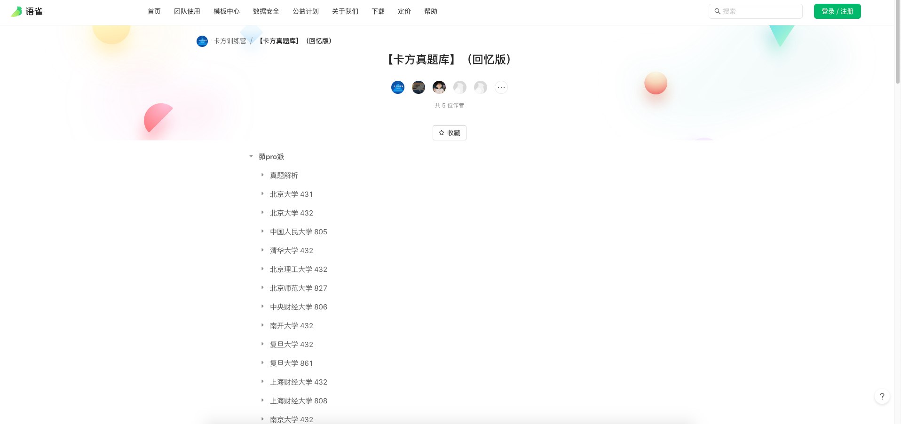
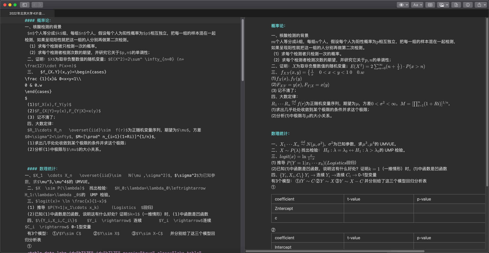
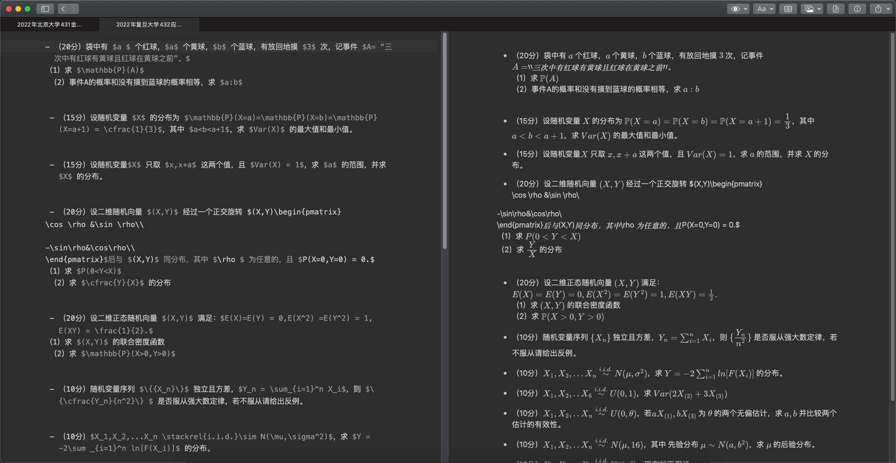
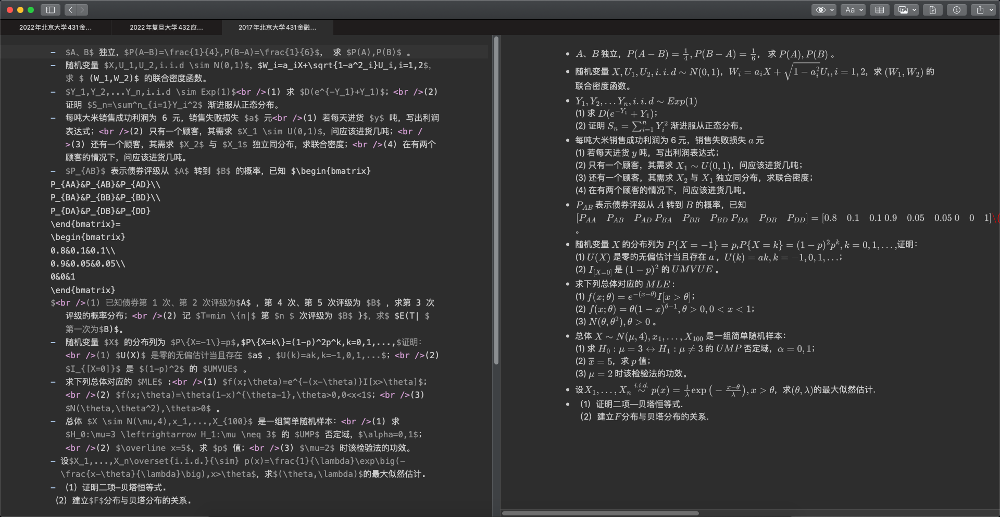

# 一个小爬虫项目&统计考研真题分享
## 目标网站
[卡方真题库](https://www.yuque.com/kafangxunlianying/qndurp/)

## 项目具体内容
- 保留原有的文件夹结构
- 把该网页上所有的试题抓取下来
- 格式化为markdown语法

## 抓取文件效果一览

## 使用到的库（Requirements）
- pandas - 1.4.2
- parsel - 1.6.0
- urllib3 - 1.26.9
- requests, re, json, os, time - Python 3.10.5

